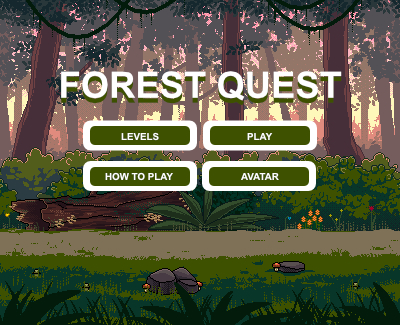

# Portfolio
This is my portfolio of works.

# Table of Contents
* Forest Quest Game

# Game Forest Quest
this is a game i created for my assignment at MCAST using Construct 3. The objective of this game is to get your player through the forest by finishing quests and going through obstacles. Each time the player wins a quest they get closer to the end of the forest where the game finishes. 

